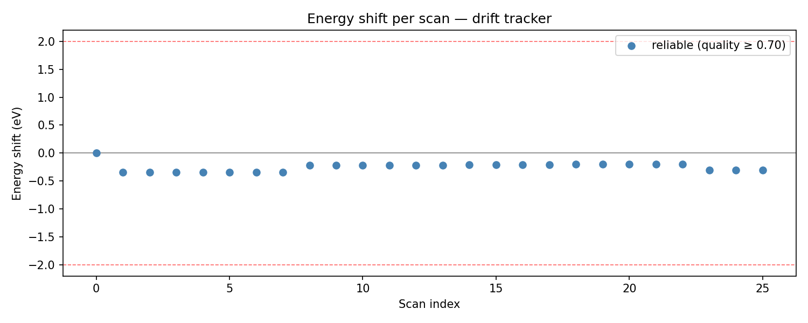
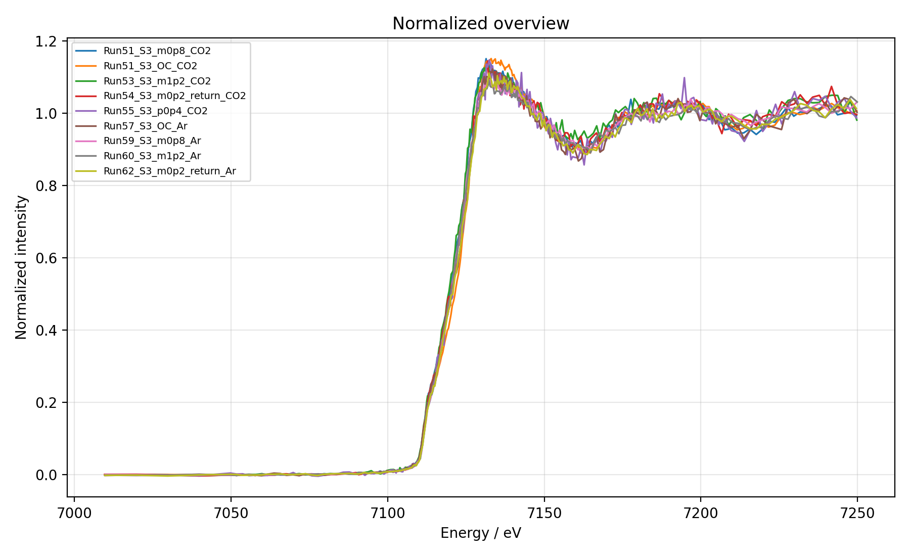
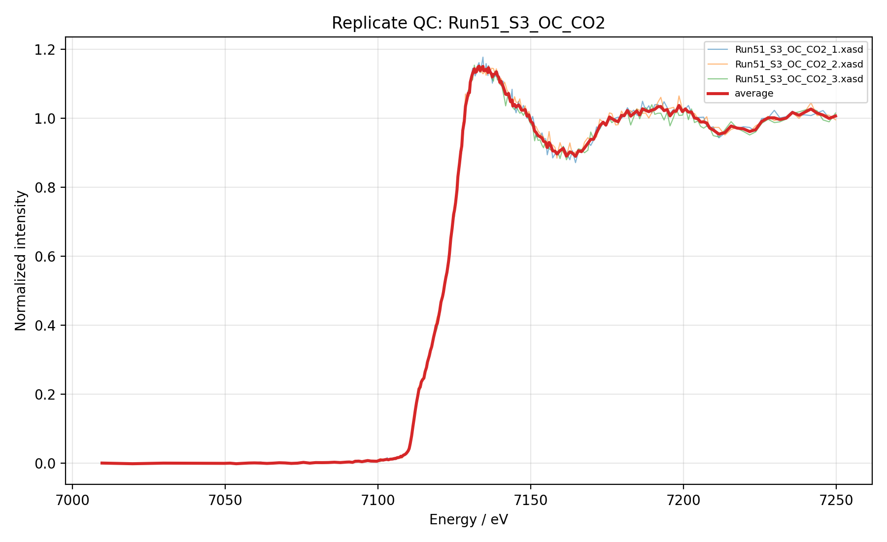
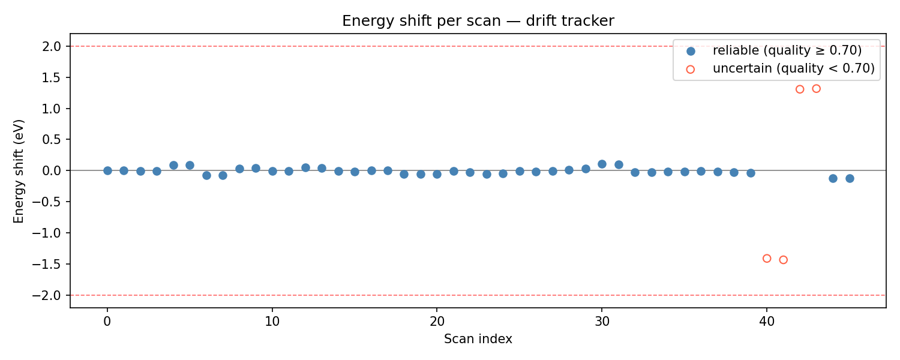
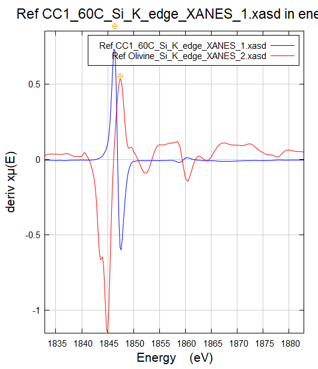
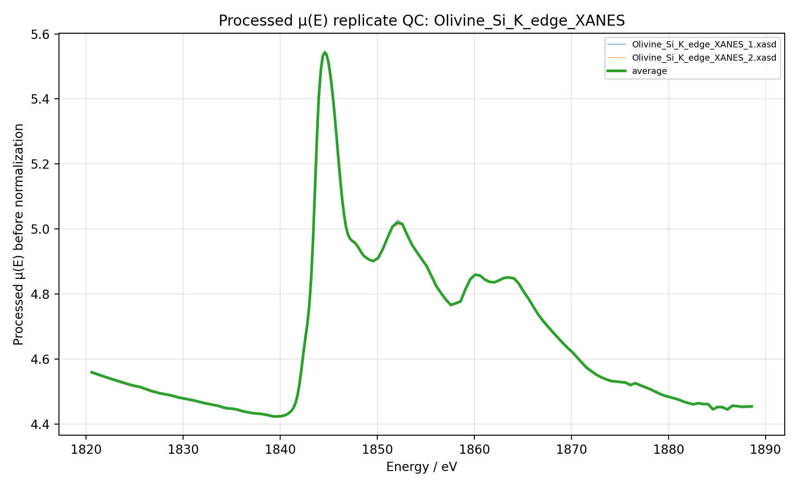
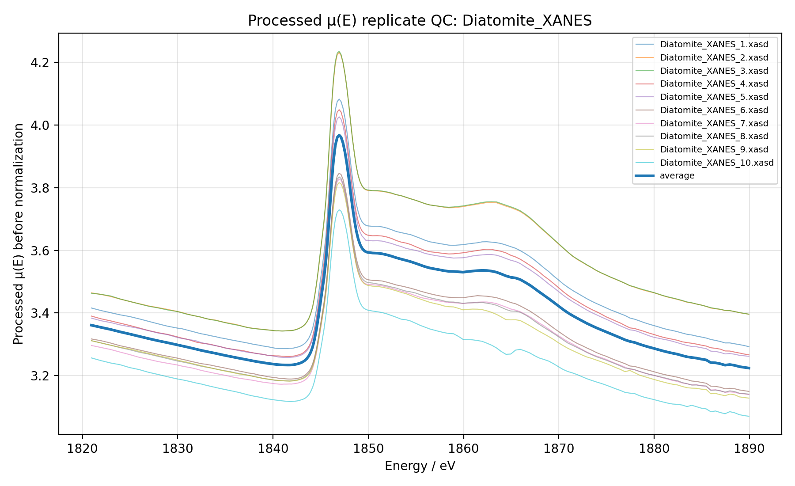

# AstraXAS

**Open-source XAS preprocessing and visualization toolkit originally developed for ASTRA beamline `.xasd` data at the SOLARIS Synchrotron.**

AstraXAS provides automated workflows for X-ray absorption spectroscopy (XAS) preprocessing, including foil drift correction, alignment quality checks, optional deglitching, replicate alignment, scan merging, Athena-style normalization, automatic QC plots, and interactive spectrum visualization. Although originally developed around the ASTRA beamline at the SOLARIS Synchrotron, the processing workflow is adaptable to other XAS beamlines provided that compatible detector channels and energy-resolved scan formats are available.

---

## Features

- **Automatic foil drift correction** — aligns each scan to a reference foil (inline I₂ or separate foil files) using derivative-shape matching, a coarse global grid search, and local refinement
- **Alignment quality scoring** — reports a Pearson-r quality score for every alignment and warns when scans fall below a configurable quality threshold
- **Merge-then-normalize workflow** — averages raw μ(E) replicates first, then applies normalization once to the merged spectrum, following common Athena-style XAS preprocessing practice
- **Athena-comparable normalization** — uses Larch's `pre_edge` with the same conceptual parameters as Athena (pre-edge range, normalization range, polynomial order, E₀). Numerical results are typically very close but are not byte-identical to Athena; see Known Limitations.
- **Three analysis modes** — fluorescence (`IF/I0`), transmission (`ln(I0/I1)`), and reference (`ln(I1/I2)`)
- **Two alignment sources** — inline reference channel (I₂ measured in every scan) or separate foil files identified by a filename keyword
- **Pre-merge deglitching** — optional automatic interpolation of narrow detector spikes and manual range interpolation for broader inspected artifacts
- **Automatic outlier detection** — optionally flag and exclude replicates that deviate from the group mean by a configurable RMS threshold
- **Shift rejection** — optionally exclude replicates whose energy shift exceeds a threshold before merging
- **Validation warnings** — reports missing/weak channels, incompatible modes, and energy-window issues before processing decisions are made
- **Detector jump diagnostics** — optional diagnostic-only raw detector spike reporting with a structured `ASTRA_detector_jumps.dat` file
- **Self-absorption flag** — optional fluorescence-mode heuristic that flags likely self-absorption when the fluorescence white-line amplitude is suppressed relative to simultaneously available sample transmission; QC flag only, no correction
- **Beamtime Mode (preview)** — live per-scan QC as scans arrive in a watch folder, plus live group merge-normalize when replicates accumulate, with per-scan plots, a live HTML dashboard, and a replay simulator for offline testing
- **Detector raw export** — saves all raw detector channels (I0, I1, I2, IF, FDT, Ir) alongside processed outputs, plottable directly in the Spectrum Viewer
- **Automatic plots** — detector health overview, analysis signal QC, processed μ(E), background-corrected, and normalized overview plots; pre-normalization and normalized replicate QC plots; optional energy drift tracker
- **Edge presets** — editable starting templates for common ASTRA-accessible edges
- **PDF QC report** — optional single-file processing and quality-control report generated from existing outputs
- **Interactive Spectrum Viewer** — compare any `.dat` files side by side with Savitzky-Golay smoothing, raw/smoothed overlay, legend toggling, click-to-read energy values, and publication-ready figure export
- **JSON config system** — save and load processing parameters per edge or experiment type
- **CLI and Python API** — run headless from the command line or call `process_folder()` from a script

---

## Installation

AstraXAS requires Python 3.10 or newer.

### From source (recommended for now)

```bash
git clone https://github.com/cemcelikutku/AstraXAS.git
cd AstraXAS
pip install -e .
```

The `-e` flag installs in editable mode, so `git pull` updates the package without reinstalling.

On Ubuntu/Debian, the GUI may also require Tkinter from the system package manager:

```bash
sudo apt install python3-tk
```

Tkinter is not a normal pip dependency on most Linux distributions, so this step is independent of the pip install above.

### Verify the install

```bash
astra-xas --help
astra-xas-beamtime --help
```

Both commands should print argparse help text without errors.

### For development and testing

```bash
pip install -e ".[dev]"
pytest
```

All existing tests should pass.

---

## Quick start

### GUI

```bash
python -m astra_xas.gui
```

### Command line

```bash
astra-xas /path/to/xasd/folder --mode fluo --e0 7121.030
```

The `astra-xas` console command is installed by `pip install -e .` (see Installation). `python -m astra_xas.cli ...` continues to work as an alternate invocation.

Use a JSON config file for parameters not exposed as individual CLI flags (pre-edge windows, alignment window, detector thresholds, etc.):

```bash
astra-xas /path/to/data --config configs/p_k.json
```

Explicit CLI flags override config file values, which in turn override AstraConfig defaults.

Options:

| Flag | Default | Description |
|---|---|---|
| `input_dir` | required | Folder containing `.xasd` files |
| `-o`, `--output-dir` | `<input>-processed` | Output folder |
| `-c`, `--config` | `None` | Path to JSON config file (see Configuration) |
| `--mode` | `fluo`* | Sample signal: `fluo`, `trans`, or `ref` |
| `--foil-mode` | `trans`* | Foil alignment signal: `trans`, `ref`, or `fluo` |
| `--e0` | `7121.030`* | Edge energy in eV |

\* The asterisked flags fall back to `AstraConfig` defaults (or the config-file values, if `--config` is provided) when not set explicitly. Explicit CLI flags always win over config-file values, which always win over defaults.

### Python API

```python
from astra_xas import AstraConfig, process_folder

config = AstraConfig(
    analysis_mode="fluo",
    alignment_source="inline_ref",
    e0=7121.030,
    pre1=-229.74, pre2=-49.98,
    norm1=55.07,  norm2=227.22,
    nnorm=1,
    alignment_quality_warn_threshold=0.7,
    alignment_grid_points=50,
    save_drift_plot=True,
    plot_energy_min=7100.0,
    plot_energy_max=7160.0,
)

result = process_folder("/path/to/xasd/folder", config=config)
print(result["output_dir"])
```

---

## Workflow

```
.xasd files
    │
    ├─ Load detector channels (E, I0, I1, I2, IF, FDT, Ir)
    ├─ Run validation warnings on channels, modes, and energy windows
    ├─ Align each scan to foil reference via derivative-shape matching
    ├─ Score alignment quality and record energy drift
    ├─ [Optional] Reject scans with large alignment shifts
    ├─ [Optional] Run detector jump diagnostics on raw channels
    ├─ Compute μ(E) per scan (IF/I0, ln(I0/I1), or ln(I1/I2))
    ├─ [Optional] Deglitch aligned replicates before merging
    ├─ [Optional] Reject outlier replicates inside each group
    │
    ├─ Average aligned μ(E) replicates  ← merge first
    ├─ Run Larch pre_edge on merged spectrum  ← normalize once
    ├─ [Optional] Self-absorption flag (fluorescence mode only)
    │
    └─ Output
         ├─ <sample>_processed.dat   (merged processed μ(E))
         ├─ <sample>_bkgcorr.dat     (background-subtracted)
         ├─ <sample>_norm.dat        (normalized μ(E))
         ├─ <sample>_flat.dat        (flattened normalized μ(E))
         ├─ detector_raw/<scan>_detector_raw.dat  (all detector channels)
         ├─ plots/overview/          (dataset-level overview and QC plots)
         ├─ plots/replicate_qc/      (scan-to-scan replicate QC plots)
         ├─ ASTRA_energy_shifts.dat
         ├─ ASTRA_foil_alignment.dat
         ├─ ASTRA_processing_report.txt
         └─ [Optional] ASTRA_processing_and_QC_report.pdf
```

---

## Alignment and drift tracking

AstraXAS supports two alignment sources:

- `inline_ref` uses the reference channel (`ln(I1/I2)`) measured in each sample scan. The first sample scan is the zero-shift reference.
- `separate_foil` uses files whose names contain `foil_keyword` as reference foil scans. The first foil scan is the zero-shift reference, and each sample inherits the shift and quality of its most recent assigned foil scan.

**Choosing the alignment source.** The choice depends on your beamline setup:

- Use `inline_ref` when each scan includes a reference channel — typically a third ion chamber after the second sample, measured simultaneously with the sample. This is the standard configuration for *operando* electrochemistry and any setup where pausing the experiment to collect a separate foil scan is impractical.
- Use `separate_foil` when foil reference scans are collected as separate files (e.g., a copper foil scan run at the start of each sample series). The watcher and offline CLI identify these files by the `foil_keyword` substring in their filename (default `"foil"`).

The `AstraConfig` default is `separate_foil`. If your data has no files matching the foil keyword, AstraXAS will raise `RuntimeError: No foil files found`. Set `alignment_source = "inline_ref"` (in your JSON config or via the GUI/Python API) to use the per-scan reference channel instead.

By default, `alignment_anchor_mode="first_scan"` preserves this behavior. To compare multiple folders against the same internal reference, set `alignment_anchor_mode="selected_file"` and provide `alignment_anchor_path` pointing to a `.xasd` scan. The selected anchor file is loaded, validated, and used as the zero-shift alignment anchor for all scans in the folder. This separates the alignment source (`inline_ref` or `separate_foil`) from the alignment anchor (the file that defines zero shift).

Alignment is performed in the configured energy window (`align_window_min/max`) and bounded by `shift_bound_min/max`. The current engine sanitizes non-finite points, sorts spectra by energy, removes duplicate moving-spectrum energies, checks that the reference has usable derivative amplitude, then searches for the best shift using a coarse grid followed by local optimization. The moving spectrum is interpolated with a cubic spline before derivative comparison.

Each computed alignment writes:

- `shift_eV` — energy shift applied to the scan or foil.
- `fit_error` — residual mean-squared error between z-scored derivatives.
- `alignment_quality` — Pearson correlation between z-scored derivatives at the best shift. Values near `1.0` are reliable; values below `alignment_quality_warn_threshold` are suspect.

If alignment cannot be evaluated because the reference or moving spectrum is unusable, AstraXAS sets `shift_eV = 0.0`, `fit_error = NaN`, and `alignment_quality = 0.0`, then records an explicit warning.

Set `save_drift_plot=True` to write `plots/overview/drift_tracker.png`. Reliable scans are shown as filled blue circles, while low-quality scans are shown as open red circles. Red dashed horizontal lines mark `±warn_shift_abs_eV`.

The processing report and alignment shift tables record alignment source, alignment signal, alignment anchor mode, selected anchor file if any, whether the anchor loaded successfully, and the shift sign convention. A selected anchor provides a shared internal energy reference; it does not guarantee absolute energy calibration unless the anchor itself was externally calibrated.

---

## Detector health overview

When `save_detector_health_overview_plot=True`, AstraXAS writes `plots/overview/detector_health_overview.png`. This is a stacked diagnostic PNG that plots individual sample scan traces before normalization, so beam drops, detector jumps, spikes, or unstable channels are easier to spot than in averaged spectra.

The channel set is mode-aware:

- Fluorescence mode: `I0`, `IF`, and `FDT` when available.
- Transmission mode: `I0` and `I1`.
- Reference mode: `I1`, `I2`, and `ln(I1/I2)`.
- If reference-channel data are available in fluorescence or transmission mode, `ln(I1/I2)` is added as an extra panel.

Missing or non-plottable channels are skipped gracefully. `ASTRA_processing_report.txt` records whether the detector health overview was created and lists included and skipped channels.

---

## Analysis signal QC

When `save_analysis_signal_qc_plot=True`, AstraXAS writes `plots/overview/analysis_signal_qc.png`. This plot shows the actual per-scan analysis signal before final normalization, with individual scan traces kept visible and a black diagnostic average trace added when multiple traces can be overlaid.

The plotted signal follows `analysis_mode`:

- Fluorescence mode: `IF/I0`
- Transmission mode: `ln(I0/I1)`
- Reference mode: `ln(I1/I2)`

This plot is intended to answer whether detector-channel artifacts cancel out or survive in the signal that is actually processed. Missing or non-finite traces are skipped gracefully, and `ASTRA_processing_report.txt` records the plotted signal, number of individual traces, whether an average trace was added, and any skipped traces.

---

## Processed μ(E) replicate QC

When `save_processed_mu_replicate_qc_plot=True`, AstraXAS writes one pre-normalization replicate QC plot per sample group:

```text
plots/replicate_qc/<sample>_processed_mu_replicate_qc.png
```

This plot uses the aligned and interpolated processed μ(E) replicate spectra on the common group grid, after optional deglitching and outlier filtering, but before final Larch pre-edge normalization or flattening. Individual scans are shown with a thicker average trace so scan-to-scan consistency can be checked before normalization has a chance to hide differences.

This is different from `plots/overview/processed_mu_overview.png`: the overview shows only averaged group spectra, while processed μ(E) replicate QC shows individual scans plus the group average for each sample.

---

## Validation warnings

Before alignment and merging, AstraXAS runs a diagnostic validation pass on the scans that remain after manual exclusions. This pass does not modify data, deglitch, reject scans, or change processing results. It only records warnings when selected modes or energy ranges look inconsistent with the available data.

Validation checks include:

- Required channels for `analysis_mode`: `IF` and `I0` for fluorescence, `I0` and `I1` for transmission, `I1` and `I2` for reference.
- Required reference channels for `inline_ref` alignment.
- Required foil-alignment channels in `separate_foil` mode.
- All-zero, all-non-finite, nearly flat, or non-positive channels where division/log calculations need positive values.
- Plot range, alignment window, pre-edge range, and normalization range overlap with the data energy range.
- Weak structure in the selected alignment signal inside the alignment window.

Warnings are printed in the processing log and written to a dedicated `Validation warnings` section in `ASTRA_processing_report.txt`. If no validation warnings are found, the report writes `Validation warnings: none`.

---

## Detector jump diagnostics

When `enable_detector_jump_warnings=True`, AstraXAS runs a diagnostic-only detector jump check on raw detector channels after alignment shifts are known and before any deglitching or averaging. It can write `ASTRA_detector_jumps.dat` when spike-like jumps are detected, and it adds a conservative summary-level detector-jump count to `ASTRA_group_summary.dat`.

This check uses point-to-point MAD thresholding plus recovery-window spike-vs-step discrimination, so monotonic absorption-edge-like steps are not treated as detector jumps. The detailed table can include primary raw-channel, FDT, and derived-signal sharp features, but the main processing report emphasizes significant primary raw-channel jumps (`I0`, `I1`, `I2`, `IF`) outside the edge/alignment window. FDT diagnostic spikes and derived-signal edge features are reported separately and excluded from the main summary. It never modifies detector arrays, processed spectra, normalized spectra, alignment shifts, or plot data.

---

## Beamtime Mode (preview)

Beamtime Mode is a headless preview workflow for live per-scan QC while `.xasd` files are being written during an experiment. The current scope is intentionally small: it watches a single incoming folder, validates each new scan, runs per-scan detector jump diagnostics, and maintains a session log, checkpoint-based crash recovery, per-scan QC plots, a live HTML dashboard, live group merge-normalize, and a Live groups dashboard section.

This preview does not provide a GUI panel, foil drift correction, cross-scan alignment, automatic group outlier rejection, or the full offline `process_folder()` pipeline yet. Those parts are planned for later releases.

Start a watch session with:

```bash
astra-xas-beamtime watch /path/to/incoming
```

For longer beamtime sessions, pass `--log-file PATH` or `-l PATH` to mirror stdout to a persistent file. The file is opened in append mode and line-buffered, so you can `tail -f` it in real time during the experiment. Each line is prefixed with an ISO timestamp:

```bash
astra-xas-beamtime watch /data/incoming \
    -c configs/p_k.json \
    -l ~/beamtime_logs/2026-05-15.log
```

The log file captures watcher and replay stdout messages, including scan status lines and warnings. The structured Beamtime session log remains at `<output_dir>/ASTRA_beamtime_session.log`. The two files serve different purposes: the tee log is a human-readable transcript, while the session log is the structured per-scan record.

By default, Beamtime Mode writes to `<incoming>-beamtime`. Use `-o / --output-dir` to choose another folder, or `-c / --config` to load an `AstraConfig` JSON file. The watcher considers only `.xasd` files directly inside the watched folder and ignores subdirectories.

While the watcher is running, AstraXAS writes a per-scan QC plot under `<output_dir>/plots/beamtime/<scan>.png` and a live HTML dashboard at `<output_dir>/index.html` that auto-refreshes every five seconds. Open `index.html` in any browser to monitor scan-by-scan QC during a beamtime. The dashboard uses only relative paths, so it works over `file://` or via `python -m http.server` from the output directory.

When two or more replicates of the same sample group arrive, AstraXAS automatically merges them and writes live normalized outputs under `<output_dir>/groups/<sample>_norm.dat`, plus `_processed`, `_flat`, and a per-group replicate QC plot. The dashboard gains a **Live groups** section showing every group's replicate count, merge status, and latest QC plot. Live group outputs are deliberately separated from offline `process_folder()` outputs to prevent name collisions.

To test without a beamline, create your own synthetic source folder and replay it into a watch folder:

```python
from pathlib import Path
from astra_xas.beamtime._synthetic import write_synthetic_xasd

source = Path("/tmp/astra_synthetic_source")
source.mkdir(parents=True, exist_ok=True)
for i in range(1, 6):
    write_synthetic_xasd(source / f"scan_{i:03d}.xasd", seed=i)
```

Then edit `examples/scenarios/clean_replay.yaml` to point `source_dir` at that folder and run:

```bash
astra-xas-beamtime replay examples/scenarios/clean_replay.yaml
```

The package does not ship example `.xasd` files. The synthetic generator is a software test fixture only; it is not physically accurate and should not be used as a reference spectrum.

---

## Validation on real data

The case studies below use two real datasets processed end-to-end with AstraXAS in offline mode. They illustrate complementary aspects of the tool: the Fe K-edge dataset shows clean output on a well-controlled operando experiment, while the Si K-edge dataset shows how the QC system behaves on chemically distant samples and on data containing real instrumental artifacts.

The two datasets demonstrate different stages of the pipeline. For Fe K-edge, the accessible post-edge range (~150 eV past the edge) supports clean normalization, so the Fe K case studies show normalized output. Si K-edge data has an intrinsically narrow accessible post-edge range (~45 eV), which makes polynomial normalization to a flat post-edge unreliable for any tool — Si K data is challenging to normalize reproducibly even by hand. The Si K case studies therefore show processed μ(E) (merged, aligned, deglitched) before normalization, where the alignment and replicate-consistency story can be evaluated cleanly without being confounded by limited-range normalization artifacts.

### Fe K-edge — clean baseline on operando electrocatalysis data

The Fe K dataset is from an operando electrocatalysis experiment on sample S3 at varying applied potentials in CO₂ and Ar atmospheres (26 scans across 9 sample groups, with 6 reference Fe foil scans). Processing used `alignment_source = separate_foil` with a selected anchor foil scan. All 26 scans aligned reliably (Pearson-r quality ≥ 0.7); none were flagged as low-quality. The drift tracker records a small systematic energy drift of ~0.15 eV across the session, well within the ±2 eV safety bound:



*Figure: per-scan energy shift drift tracker for the Fe K-edge dataset. The smooth ~0.15 eV downward drift across scan indices is real beamline drift over the course of the experiment, tracked cleanly by the alignment routine.*

The merge-then-normalize workflow produces a normalized overview where all nine operando states overlay tightly through the edge rise (7110–7125 eV). The post-edge settles cleanly to 1.0 with visible EXAFS-like oscillations preserved in the 7150–7250 eV range. Subtle but real variation in the white-line and post-edge regions reflects actual chemistry differences between potentials and atmospheres rather than noise:



A representative replicate QC plot (Run51_S3 at open circuit in CO₂, three replicates) shows tight scan-to-scan agreement through the entire range, with the merged average tracking the replicate envelope faithfully through the edge, white-line, and EXAFS region:



In addition to the normalized outputs, this dataset triggered the self-absorption diagnostic: three Ar-atmosphere groups (Run59, Run60, Run62) were flagged with strong-severity ratios (0.19, 0.25, 0.43 — well below the `normal` threshold of 0.85). The flagged groups are recorded in `ASTRA_self_absorption_flags.dat` with amplitudes, ratios, and severity classifications. The diagnostic does not modify the spectra; flagged groups should be inspected manually before quantitative interpretation.

### Si K-edge — QC behavior on chemically distinct samples

The Si K dataset (46 scans, 19 groups, `alignment_source = inline_ref`) mixes synthesized samples (CC and OL series) with reference materials (Diatomite, Olivine, Silica Gel, MK Sigma, SiO₂ Sigma). Si K-edge data is intrinsically more challenging than Fe K-edge: low photon energies, higher absorption, harder sample preparation, and a narrow accessible post-edge range. This dataset stresses the QC system rather than producing publication-grade normalized spectra.

The drift tracker for the Si K dataset tells a different story from the Fe K one. Forty-two scans aligned reliably, but four scans (Olivine ×2 and Silica Gel ×2) were flagged with low alignment quality (0.25 to 0.59, all below the 0.70 warning threshold). All flagged scans remained within the ±2 eV safety bound and stayed in the analysis with a warning rather than being auto-rejected:



*Figure: filled blue circles are reliable alignments (quality ≥ 0.70); open red circles are low-quality alignments (quality < 0.70). The four flagged scans cluster between scan indices 40–43.*

#### Case study: alignment of chemically distinct samples

The Olivine alignment was flagged with quality 0.25. The figure below shows why. AstraXAS aligns spectra by matching the *derivative* shape of the alignment signal inside the alignment window. The reference (CC1_60C, blue) shows a single sharp derivative peak around 1846 eV. Olivine (red) shows a different derivative shape: broader, multi-peak structure that reflects its magnesium-silicate chemistry rather than a calibration error.



Cross-correlating those two derivatives gives a low-confidence shift estimate. AstraXAS records this as low alignment quality, prints a warning, and continues processing — the user decides whether to include or exclude the flagged scans.

The Olivine data itself is fine. The two replicates overlay essentially perfectly when their internal alignment is checked (processed μ(E) before normalization, showing the multi-peak white-line structure characteristic of olivine):



The takeaway: low alignment quality does not necessarily mean bad data. It often means the sample is chemically too distant from the alignment anchor for derivative-matching to give a confident shift. When this happens, recommended actions are:

- Use a chemically closer reference scan as the alignment anchor by setting `alignment_anchor_mode = "selected_file"` and `alignment_anchor_path` to a representative scan of the same or similar material.
- Inspect the flagged group's replicate QC plot to confirm internal consistency.
- Document the flag in the analysis notes; a low-quality alignment warning is a meaningful piece of QC metadata, not a hidden failure.

#### Case study: automatic deglitching of narrow artifacts

Ten Diatomite XANES scans contained narrow spikes near 1859 eV, likely a beamline monochromator artifact. AstraXAS detected and auto-interpolated 47 single-point excursions across these scans. Every interpolation was logged in `Diatomite_XANES_deglitch_log.dat`, including the affected scan, the deglitch method, and the interpolated energy positions, so the correction is traceable.

The processed μ(E) replicate QC plot shows ten Diatomite replicates after deglitching: the spikes are gone, post-deglitch consistency is good, and the group average tracks the bulk of replicates closely. The vertical spread between replicates reflects real beam-stability variation across the ten-scan series, which is preserved by the merge step rather than smoothed away:



Automatic deglitching is intentionally conservative — it only targets narrow, point-like excursions. Broader artifacts (multi-point distortions, beamline disturbances spanning several eV) should be handled with manual range deglitching, which is also logged.

---

## Self-absorption diagnostic

When `analysis_mode="fluo"` and `enable_self_absorption_check=True`, AstraXAS can flag possible fluorescence self-absorption / over-absorption. The diagnostic compares the normalized white-line amplitude of the fluorescence signal against the normalized white-line amplitude of the simultaneously available sample transmission signal, `ln(I0/I1)`, and flags groups where the fluorescence white-line amplitude is suppressed.

This is a heuristic QC flag, not a correction. It does not modify processed spectra, normalized spectra, alignment, averaging, deglitching, or exported spectral values. The ratio can also be influenced by sample geometry, detector effects, noise, normalization quality, and chemical or sampling differences, so flagged groups should be inspected by the user.

The diagnostic runs only for fluorescence-mode sample groups and only uses accepted scans: scans that survive manual exclusions, optional shift rejection, and group-level outlier filtering. The diagnostic transmission average is built from the same accepted scans as the final fluorescence average. If usable `I0`/`I1` transmission data are not available, or if diagnostic normalization cannot be evaluated reliably, the group is marked `skipped`.

Sensitivity controls the fluorescence/transmission white-line amplitude ratio threshold:

| Sensitivity | Threshold |
|---|---:|
| `relaxed` | `0.75` |
| `normal` | `0.85` |
| `strict` | `0.92` |
| `custom` | `self_absorption_custom_threshold` |

Classification is based on `ratio_fluo_over_trans = fluo_white_line_amplitude / trans_white_line_amplitude`. Ratios greater than or equal to the selected threshold are `ok`; ratios below the threshold are `flagged`; invalid or insufficient diagnostics are `skipped`. Flag severity uses absolute ratio bands independent of the selected sensitivity: `mild` for ratios `>= 0.75`, `moderate` for ratios `>= 0.60`, and `strong` below `0.60`.

White-line and continuum windows are anchored to `config.e0`. Defaults are:

| Window | Default offset relative to E₀ |
|---|---|
| White-line | `0.0` to `35.0` eV |
| Continuum | `50.0` to `150.0` eV |

The normalized diagnostic spectra are measured using a smoothed 95th percentile in the white-line window minus the median continuum level. If the continuum window is unavailable but the white-line window is usable, AstraXAS falls back to a continuum level of `1.0` and records that note. The default minimum transmission white-line amplitude is `0.03`, and the default minimum number of finite points in a diagnostic window is `5`.

When the diagnostic runs, AstraXAS writes `ASTRA_self_absorption_flags.dat` even if every group is skipped. If the analysis mode is not fluorescence, or if `enable_self_absorption_check=False`, this file is not created. The table columns are:

```text
sample  status  severity  ratio_fluo_over_trans  fluo_white_line_amplitude
trans_white_line_amplitude  threshold_used  sensitivity  white_line_window_eV
continuum_window_eV  n_replicates_used  note
```

Rows with `status=ok` include measured amplitudes and an `OK` note. Rows with `status=flagged` include the ratio, threshold, severity, and a note that the fluorescence white-line amplitude is suppressed relative to transmission. Rows with `status=skipped` use `nan` where amplitudes or ratios are unavailable and include a clear skip reason.

When `save_self_absorption_qc_plots=True`, checked groups with `status=ok` or `status=flagged` also write:

```text
plots/replicate_qc/<sample>_self_absorption_qc.png
```

The QC plot overlays the normalized fluorescence diagnostic spectrum and normalized sample transmission diagnostic spectrum, with the white-line and continuum windows marked. Flagged groups are also added to the standard `Processing warnings` list and summarized in both `ASTRA_processing_report.txt` and `ASTRA_processing_and_QC_report.pdf`.

The GUI exposes this feature in the self-absorption diagnostic section, including enable/disable, sensitivity, custom threshold, white-line and continuum offsets, minimum transmission amplitude, minimum points, and QC plot saving.

---

## Deglitching

AstraXAS includes optional deglitching for scan-level artifacts. Deglitching operates on each aligned replicate before replicate averaging. The merge-then-normalize workflow is preserved: corrected μ(E) replicates are merged first, and Larch `pre_edge` normalization is applied once to the merged spectrum.

Two deglitching modes are available:

- **Automatic deglitching** interpolates isolated, narrow point-like detector spikes. It preserves the original energy grid and is intended for single-point excursions, not structured spectral features.
- **Manual range deglitching** interpolates a user-defined energy interval from neighboring points. It is intended for broader artifacts selected after visual inspection.

Automatic deglitching should be used conservatively. Broad artifacts, beamline disturbances, or multi-point distortions should be handled with manual range interpolation.

GUI usage:

1. Enable **Deglitching**.
2. Choose `automatic`, `manual`, or `both`.
3. For automatic deglitching, set the threshold, window half-width, and optional energy bounds.
4. For manual range deglitching, set the artifact energy range and the number of margin points used for interpolation.

Python examples:

```python
from astra_xas import AstraConfig, process_folder

# Automatic: narrow detector spikes only
config = AstraConfig(
    enable_auto_deglitch=True,
    deglitch_threshold=5.0,
    deglitch_window=5,
    deglitch_min_energy=7100.0,
    deglitch_max_energy=7160.0,
)

process_folder("/path/to/xasd/folder", config=config)
```

```python
from astra_xas import AstraConfig, process_folder

# Manual range: broader artifact selected after inspection
config = AstraConfig(
    enable_manual_deglitch_range=True,
    manual_deglitch_min_energy=7132.0,
    manual_deglitch_max_energy=7135.0,
    manual_deglitch_margin_points=5,
)

process_folder("/path/to/xasd/folder", config=config)
```

When deglitching changes points, AstraXAS writes a per-group `<sample>_deglitch_log.dat`. `ASTRA_processing_report.txt` summarizes automatic and manual deglitched point counts separately.

---

## File naming convention

AstraXAS groups `.xasd` files into samples by filename. Replicates are identified by a trailing numeric suffix:

```
Fe_sample_1.xasd   →  base name: Fe_sample,  replicate: 1
Fe_sample_2.xasd   →  base name: Fe_sample,  replicate: 2
Fe_foil_1.xasd     →  foil file (contains "foil" keyword)
```

The `foil_keyword` parameter (default: `"foil"`) determines which files are treated as reference foil scans for alignment.

---

## Output files

For each sample group, AstraXAS writes the following to the output directory:

| File | Contents |
|---|---|
| `<sample>_processed.dat` | Merged processed μ(E) before background removal |
| `<sample>_bkgcorr.dat` | Background-corrected μ(E) |
| `<sample>_norm.dat` | Normalized μ(E) |
| `<sample>_flat.dat` | Flattened normalized μ(E) |
| `detector_raw/<scan>_detector_raw.dat` | Raw detector channels for every individual scan |
| `plots/replicate_qc/<sample>_normalized_replicate_qc.png` | Normalized replicate overlay QC plot |
| `plots/replicate_qc/<sample>_processed_mu_replicate_qc.png` | Pre-normalization processed μ(E) replicate QC plot |
| `plots/replicate_qc/<sample>_self_absorption_qc.png` | Optional fluorescence self-absorption QC plot for checked groups when `save_self_absorption_qc_plots=True` |
| `plots/overview/detector_health_overview.png` | Mode-aware stacked detector QC plot using individual sample scan traces |
| `plots/overview/analysis_signal_qc.png` | Mode-aware per-scan analysis signal before final normalization, with optional average overlay |
| `plots/overview/aligned_averaged_IF_overview.png` | Optional aligned/interpolated/averaged IF detector signal by group |
| `plots/overview/processed_mu_overview.png` | All merged processed μ(E) spectra overlaid |
| `plots/overview/background_corrected_overview.png` | All background-corrected spectra overlaid |
| `plots/overview/normalized_overview.png` | All normalized spectra overlaid |
| `plots/overview/drift_tracker.png` | Optional scan-by-scan energy shift plot, written when `save_drift_plot=True` |
| `<sample>_deglitch_log.dat` | Deglitch point log, written only when deglitching modifies points |
| `ASTRA_detector_jumps.dat` | Diagnostic detector jump records, written only when jump-like spikes are detected |
| `ASTRA_self_absorption_flags.dat` | Fluorescence-mode possible self-absorption diagnostic table, written when `analysis_mode="fluo"` and `enable_self_absorption_check=True` |
| `ASTRA_excluded_scans.dat` | Manually excluded scans and exclusion reasons |
| `ASTRA_auto_rejected_scans.dat` | Scans rejected by optional shift rejection |
| `ASTRA_auto_outliers.dat` | Replicates rejected by optional group-level outlier detection |
| `ASTRA_processing_report.txt` | Full parameter log, validation warnings, processing warnings, plot file lists, replicate QC counts, per-group summary, low-quality alignment count, and deglitch point counts |
| `ASTRA_energy_shifts.dat` | Per-sample shift table with alignment-anchor metadata: filename, base name, replicate id, assigned foil/reference, shift, alignment quality |
| `ASTRA_foil_alignment.dat` | Per-foil or inline-reference alignment table with alignment-anchor metadata: filename, shift, fit error, alignment quality |
| `ASTRA_normalization_summary.dat` | Edge step, E₀, and normalization metadata per group |
| `ASTRA_group_summary.dat` | Sample names, foil assignments, replicate counts, and detector-jump summary counts |
| `ASTRA_processing_and_QC_report.pdf` | Optional single-file processing and QC report with metadata, QC status, warnings, summary tables, and generated QC plots |

All `.dat` files have a commented header listing parameters and column names, and spectral `.dat` files are directly loadable in the Spectrum Viewer. `ASTRA_energy_shifts.dat` and `ASTRA_foil_alignment.dat` include the alignment anchor context so shifts can be interpreted across folders.

`ASTRA_processing_report.txt` separates `Validation warnings` from `Processing warnings`, summarizes detector jump and self-absorption diagnostics, reports processed μ(E) replicate QC and normalized replicate QC counts separately, and lists created plots under `Overview plots created` and `Replicate QC plots created`.

When `save_pdf_report=True`, AstraXAS also writes `ASTRA_processing_and_QC_report.pdf`. The PDF collects run metadata, a compact QC status summary, validation and processing warnings, detector jump and self-absorption diagnostics, alignment/drift context, overview plots, replicate QC plots, main output-file locations, and compact previews of summary tables. It is diagnostic/reporting only: it uses already-created outputs and does not recompute or modify spectra. Missing plots or tables are skipped in the PDF as “not available”; processing still completes if PDF generation fails, and the failure is recorded in `ASTRA_processing_report.txt`.

Note: `plots/detector_raw_overview.png` was the former name for the aligned averaged IF overview. Current runs write only `plots/overview/aligned_averaged_IF_overview.png`. The normalized replicate QC plot was formerly named `<sample>_replicate_qc.png`; current runs write `<sample>_normalized_replicate_qc.png`.

---

## Edge Presets

AstraXAS includes an editable edge-preset library for common starting templates: Mg K, Al K, Si K, P K, S K, Cl K, K K, Ca K, Ti K, V K, Cr K, Mn K, Fe K, Co K, Ni K, Cu K, Zn K, Ga K, Ge K, As K, Se K, and Ce L3. Presets are not final scientific parameters and are not absolute calibration. They provide approximate reference/start E0 values plus relative pre-edge, normalization, alignment, and plot windows.

In the GUI, choosing a preset in the dropdown does not change any fields by itself. Click **Apply preset** to copy the template into the editable fields. After applying, E0, pre-edge range, normalization range, alignment window, and plot range remain normal editable inputs. The Spectrum Viewer uses the current processing plot range as its default energy range when opened, so applying a preset also updates the viewer's initial range.

When a preset is applied, AstraXAS records the preset label, whether it was applied, the preset reference E0, the final E0 used, and the preset note in `ASTRA_processing_report.txt` and `ASTRA_processing_and_QC_report.pdf`.

For scripts, presets are available from `astra_xas.edge_presets`:

```python
from astra_xas import AstraConfig
from astra_xas.edge_presets import apply_edge_preset_to_config

config = AstraConfig()
apply_edge_preset_to_config(config, "p_k")
# Edit config.e0, config.pre1/pre2, config.norm1/norm2, etc. as needed.
```

Old configurations and custom/manual workflows behave the same unless a preset is explicitly applied.

---

## Spectrum Viewer

The built-in Spectrum Viewer can open any `.dat` file produced by AstraXAS — including detector raw files — or any two-column text file.

**Key features:**

- Load multiple files and compare them in a single interactive plot
- Select plot channel from raw detector signals (`I0`, `I1`, `I2`, `IF`, `FDT`, `Ir`) or computed signals (`IF/I0`, `ln(I0/I1)`, `ln(I1/I2)`)
- Savitzky-Golay smoothing with configurable window and polynomial order
- Show raw and smoothed curves simultaneously
- Click legend entries to hide/show individual spectra
- Hover to see interpolated values; left-click to print energy and signal values for all visible curves
- Press `a` to show all hidden spectra; `n` to clear clicked markers
- Save publication-ready figures (PNG, PDF, SVG) at 300 dpi
- Fully configurable axis labels, title, legend position, figure size, and line width
- Save and reload viewer sessions (file list + all settings) as JSON

---

## Configuration

Processing parameters are stored in `AstraConfig` and saveable as JSON config files. The GUI exposes the common workflow controls, while some lower-level diagnostic thresholds are config-file/API options. Common parameters:

| Parameter | Description |
|---|---|
| `version` | Version string written to reports and output headers |
| `foil_keyword` | Filename substring used to identify separate foil scans; default `foil` |
| `analysis_mode` | Sample analysis signal: `fluo`, `trans`, or `ref` |
| `alignment_source` | Alignment source: `inline_ref` or `separate_foil` |
| `alignment_anchor_mode` | Zero-shift anchor selection: `first_scan` or `selected_file` |
| `alignment_anchor_path` | Path to selected `.xasd` anchor file when `alignment_anchor_mode="selected_file"` |
| `foil_alignment_mode` | Signal used for separate foil alignment: `trans`, `ref`, or `fluo` |
| `fluo_multiplicative_constant` | Scaling factor applied to IF before computing fluorescence μ(E) |
| `e0` | Edge energy in eV |
| `edge_preset_key` | Reporting metadata for the applied edge preset; default `custom` |
| `edge_preset_label` | Human-readable preset label recorded in reports |
| `edge_preset_applied` | Whether a preset was explicitly applied; default `False` |
| `edge_preset_note` | Preset note recorded in reports |
| `pre1`, `pre2` | Pre-edge fit range relative to E₀ (eV) |
| `norm1`, `norm2` | Post-edge normalization range relative to E₀ (eV) |
| `nnorm` | Normalization polynomial order (0, 1, or 2) |
| `step`, `nvict`, `make_flat` | Additional Larch `pre_edge` options passed through by the processor |
| `align_window_min/max` | Energy window used for foil alignment |
| `shift_bound_min/max` | Maximum allowed energy shift during alignment (eV) |
| `alignment_quality_warn_threshold` | Quality threshold below which alignment warnings are emitted; default `0.7` |
| `alignment_grid_points` | Number of coarse-search grid points before local alignment refinement; default `50` |
| `interp_kind` | Interpolation kind used for scan interpolation to the group grid |
| `warn_shift_abs_eV` | Shift magnitude that triggers a processing warning |
| `exclude_filenames` | Explicit filenames to exclude before processing |
| `exclude_filename_contains` | Filename substrings to exclude before processing |
| `enable_shift_rejection` | Exclude replicates with large energy shifts |
| `reject_shift_abs_eV` | Shift threshold for rejection (eV) |
| `enable_auto_outlier_detection` | Flag replicates that deviate from the group mean |
| `outlier_rms_threshold` | RMS deviation threshold for outlier detection |
| `enable_auto_deglitch` | Interpolate isolated narrow detector spikes before merging |
| `deglitch_threshold` | Robust local threshold for automatic spike detection |
| `deglitch_window` | Local half-window used by automatic deglitching |
| `deglitch_method` | Deglitch method name; current processing uses interpolation |
| `deglitch_min_energy/max_energy` | Optional energy bounds for automatic deglitching |
| `enable_manual_deglitch_range` | Interpolate a specified energy range before merging |
| `manual_deglitch_min_energy/max_energy` | Energy interval for manual range interpolation |
| `manual_deglitch_margin_points` | Neighboring points used to interpolate the manual range |
| `enable_detector_jump_warnings` | Run diagnostic-only raw detector jump warnings; default `True` |
| `detector_jump_threshold` | Point-to-point MAD multiplier for detector jump warnings; default `10.0` |
| `detector_jump_min_relative` | Minimum relative jump size for detector jump warnings; default `0.05` |
| `enable_self_absorption_check` | Enable fluorescence-mode possible self-absorption diagnostic; default `True` |
| `self_absorption_sensitivity` | Threshold preset: `relaxed`, `normal`, `strict`, or `custom`; default `normal` |
| `self_absorption_custom_threshold` | Custom ratio threshold used when sensitivity is `custom`; default `0.85` |
| `self_absorption_wl_min` | White-line window minimum offset from E₀; default `0.0` eV |
| `self_absorption_wl_max` | White-line window maximum offset from E₀; default `35.0` eV |
| `self_absorption_cont_min` | Continuum window minimum offset from E₀; default `50.0` eV |
| `self_absorption_cont_max` | Continuum window maximum offset from E₀; default `150.0` eV |
| `self_absorption_min_trans_amp` | Minimum reliable sample transmission white-line amplitude; default `0.03` |
| `self_absorption_min_points` | Minimum finite points required in diagnostic windows; default `5` |
| `save_detector_health_overview_plot` | Save `plots/overview/detector_health_overview.png`; default `True` |
| `save_analysis_signal_qc_plot` | Save `plots/overview/analysis_signal_qc.png`; default `True` |
| `save_detector_raw_overview_plot` | Save `plots/overview/aligned_averaged_IF_overview.png`; legacy config name retained for compatibility |
| `save_processed_overview_plot` | Save `plots/overview/processed_mu_overview.png` |
| `save_bkgcorr_overview_plot` | Save `plots/overview/background_corrected_overview.png` |
| `save_norm_overview_plot` | Save `plots/overview/normalized_overview.png` |
| `save_processed_mu_replicate_qc_plot` | Save pre-normalization processed μ(E) replicate QC plots; default `True` |
| `save_replicate_qc_plots` | Save per-group replicate QC plots |
| `save_raw_overview_plot` | Legacy alias retained for old configs |
| `save_drift_plot` | Save `plots/overview/drift_tracker.png` |
| `save_foil_alignment_plots` | Compatibility field; current processing does not generate a separate foil-alignment plot |
| `save_pdf_report` | Generate `ASTRA_processing_and_QC_report.pdf`; default `True` when ReportLab is available |
| `save_self_absorption_qc_plots` | Save `plots/replicate_qc/<sample>_self_absorption_qc.png` for checked groups; default `True` |
| `plot_energy_min/max` | Energy range used for automatic overview and QC plots |

In the GUI, the **Enable deglitching** checkbox and `automatic` / `manual` / `both` mode selector are translated into `enable_auto_deglitch` and `enable_manual_deglitch_range` in the saved configuration. The **Generate PDF QC report** checkbox controls `save_pdf_report`.

The GUI defaults to `inline_ref` alignment because many ASTRA datasets include the reference channel in every scan. The `AstraConfig` dataclass default remains `separate_foil`, so scripts should set `alignment_source` explicitly when a specific workflow is required.

Save a config file for each edge (Fe K, Cu K, etc.) and load it at the start of a session.

---

## Positioning relative to Athena and Fastosh

| Feature | Athena | Fastosh | AstraXAS |
|---|---|---|---|
| Automatic foil drift correction | Manual | Manual | ✅ Automatic |
| Merge-then-normalize workflow | Manual | Manual | ✅ Default workflow |
| Pre-merge deglitching | Manual | Manual | ✅ Automatic or manual range |
| Detector raw channel plotting | ✗ | ✗ | ✅ Built-in |
| Replicate QC plots | Manual | ✗ | ✅ Automatic |
| Outlier / shift rejection | ✗ | ✗ | ✅ Configurable |
| Self-absorption flag | ✗ | ✗ | ✅ Heuristic QC flag (no correction) |
| Live beamtime QC | ✗ | Limited | ✅ Watcher + replay simulator (preview) |
| JSON config per edge | ✗ | ✗ | ✅ Save and load |
| Python scripting API | ✗ | ✗ | ✅ `process_folder()` |
| CLI | ✗ | ✗ | ✅ |
| Interactive spectrum viewer | ✓ | Limited | ✅ With session save |
| Publication figure export | ✓ | ✓ | ✅ PNG / PDF / SVG |
| EXAFS fitting | ✓ (Artemis) | Limited | Planned |

---

## Known limitations

AstraXAS is being actively stabilized. Users should be aware of the following constraints and design choices:

- **Beamline scope.** AstraXAS is currently developed and tested primarily on ASTRA / SOLARIS `.xasd` data. Other beamlines work only when their detector channels and energy-resolved scan formats match the expectations of `astra_xas.io.load_xasd` (a multi-column header-prefixed text format with energy plus at least seven detector channels).

- **Beamtime Mode is preview, not final processing.** The watcher performs live per-scan QC and live group merge-normalize, but it does not currently apply foil drift correction, cross-scan alignment, or full validation. Final scientific processing should use the offline `process_folder()` pipeline (or the `astra-xas` CLI), which provides the complete feature set.

- **Alignment quality is comparison-based.** A low alignment quality score does not mean the data is bad — it means the scan is chemically distant from the alignment anchor and derivative matching gives a low-confidence shift. The Validation case studies above show this in practice. Choose alignment anchors with similar chemistry where possible.

- **Edge presets are starting templates, not absolute calibration.** The bundled edge presets provide approximate E₀, pre-edge, normalization, and alignment windows for common edges. Users must verify and adjust these against their own data before publication. AstraXAS does not perform absolute energy calibration; absolute calibration depends on the alignment anchor itself being externally calibrated.

- **Self-absorption diagnostic is a heuristic flag, not a correction.** The fluorescence/transmission white-line amplitude ratio compares relative shapes; it does not compute a corrected μ(E). Flagged groups should be reviewed manually before interpretation.

- **Automatic deglitching is for narrow point-like spikes only.** Broader artifacts must be handled with manual range deglitching, which is intentionally not automatic to avoid silently distorting spectral features.

- **Athena-comparable, not Athena-byte-identical.** AstraXAS uses Larch's `pre_edge` for normalization, with the same conceptual parameters as Athena (pre-edge range, normalization range, polynomial order, E₀). Numerical results are typically very close to Athena's defaults but are not byte-identical because alignment, deglitching, replicate merging, and outlier filtering happen in AstraXAS's pipeline. A formal side-by-side comparison on real datasets is planned.

- **Low-energy edges have limited normalization range.** Edges below ~3 keV (e.g., Si K, P K, S K) have a narrow accessible post-edge range, which constrains polynomial normalization quality. The Si K case study in the Validation section illustrates this. For low-energy edges, processed μ(E) (pre-normalization) is often the more reproducible deliverable.

- **Test coverage is uneven.** Beamtime Mode is well-tested (Phase 1–4 plus log-file tee). The offline `process_folder` pipeline is currently validated by real-data case studies (see Validation section) rather than automated tests. Comprehensive pytest coverage of the offline pipeline is planned.

- **No formal release on PyPI yet.** Install from source via `pip install -e .` until a tagged release.

---

## License

MIT License. See [LICENSE](LICENSE) for details.

---

## Acknowledgements

AstraXAS uses [xraylarch](https://xraypy.github.io/xraylarch/) for Athena-compatible normalization via `pre_edge`. Alignment follows the derivative-matching approach described in the [Athena User's Guide](https://bruceravel.github.io/demeter/documents/Athena/index.html), with added grid search, spline interpolation, and quality scoring in AstraXAS.
